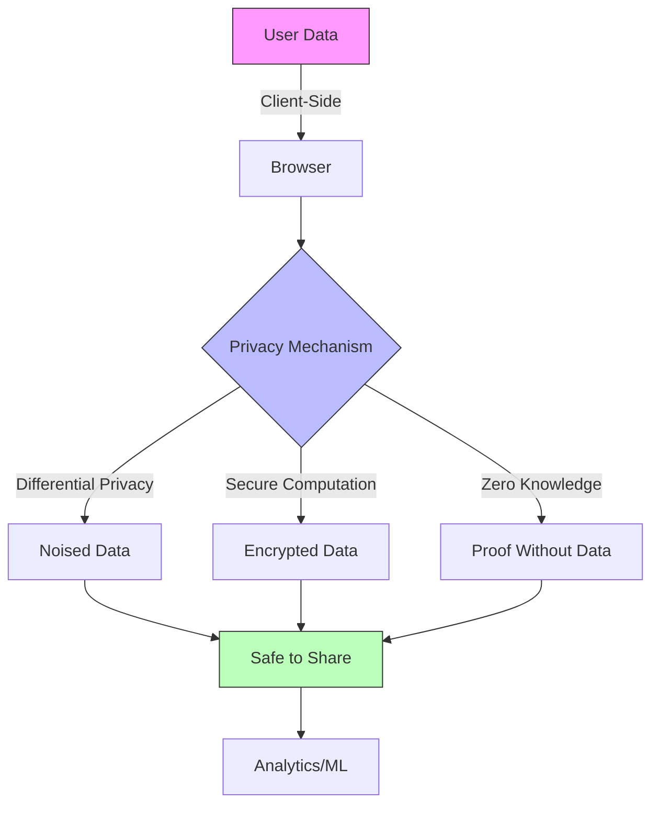

# Content Strategy Implementation Guide

## Quick Start

This guide helps you execute the research-backed content strategy outlined in `CONTENT_STRATEGY.md`.

---

## Daily Workflow

### Morning Routine (30 minutes)
1. **Check ArXiv** - Scan new papers in monitored categories
   - cs.CR, cs.AI, cs.CL, cs.LG, cs.HC, cs.SE
   - Add interesting papers to research database
   - Star 2-3 for detailed reading

2. **Conference Tracker** - Review upcoming deadlines and accepted papers
   - Check conference websites for newly posted programs
   - Identify papers relevant to current narrative arc

3. **Social Listening** - Monitor researcher activity
   - Twitter lists of key researchers
   - LinkedIn posts from academics
   - HackerNews/Reddit discussions on privacy/AI

### Writing Sessions (2-3 hours)

**Monday-Tuesday: Theory & Research**
- Break down academic papers into accessible content
- Create foundational concept posts
- Write historical context and evolution posts

**Wednesday-Thursday: Implementation**
- Code tutorials with working examples
- Architecture deep dives with diagrams
- Performance analysis and benchmarks

**Friday: Synthesis**
- Connect multiple concepts
- Case studies applying research
- Best practices and patterns

**Weekend: Community**
- Conference recaps
- Researcher spotlights
- Industry trend analysis

---

## Weekly Planning Template

### Monday Planning Session (1 hour)

**Review:**
- Last week's published posts and engagement metrics
- Progress on current narrative arc
- Research pipeline (papers to cover)

**Plan:**
- Select 7-21 post topics for the week
- Assign difficulty levels (beginner/intermediate/advanced)
- Schedule against narrative arc progression

**Example Week:**

| Day | Post 1 (Morning) | Post 2 (Midday) | Post 3 (Evening) |
|-----|------------------|-----------------|------------------|
| Mon | "DP Foundations" (B) | "Recent DP Papers" (I) | - |
| Tue | "Privacy Metrics" (I) | "CHI 2025 Recap" (B) | - |
| Wed | "Implementing DP in JS" (I) | "WebAssembly Tutorial" (B) | "Browser Crypto API" (A) |
| Thu | "Client-Side ML" (B) | "ONNX Runtime Guide" (I) | "Performance Benchmarks" (A) |
| Fri | "Privacy-First Apps" (I) | "Case Study: PDF Tool" (B) | - |
| Sat | "Researcher Spotlight" (B) | - | - |
| Sun | "Conference Preview" (B) | "Week in Privacy Research" (I) | - |

**Legend:** B = Beginner, I = Intermediate, A = Advanced

---

## Content Creation Process

### 1. Research Phase (30-60 minutes)

**For Academic Papers:**
- Read abstract and introduction
- Identify key contributions
- Note methodology and results
- Check related work section for references
- Scan conclusions for implications

**For Technical Topics:**
- Test code examples personally
- Benchmark performance claims
- Verify compatibility across browsers
- Document edge cases

**Template Questions:**
- What problem does this solve?
- Who is the intended audience?
- What are the prerequisites?
- What are the trade-offs?
- How does this connect to other posts?

### 2. Outlining (15-30 minutes)

**Standard Post Structure:**

```markdown
# [Compelling Title]

## Introduction (150-250 words)
- Hook: Why should readers care?
- Problem statement
- What this post will cover
- Who this is for

## Background (300-500 words)
- Context and prerequisites
- Historical evolution
- Current state of the art
- Why this matters now

## Core Content (1000-2000 words)
- Main concepts/implementation
- Code examples
- Diagrams and visuals
- Step-by-step walkthroughs

## Advanced Topics (Optional, 300-500 words)
- Edge cases
- Optimization techniques
- Research frontiers
- Open questions

## Practical Applications (200-400 words)
- Real-world use cases
- When to use this approach
- Common pitfalls
- Best practices

## Related Topics (100-200 words)
- Links to prerequisite posts
- Links to follow-up posts
- External resources
- Papers to read

## Conclusion (100-150 words)
- Summary of key points
- Call to action
- Next steps for readers
```

### 3. Writing (1-3 hours)

**Style Guidelines:**

**Active Voice:**
- ✅ "We implement differential privacy using the Laplace mechanism"
- ❌ "Differential privacy is implemented using the Laplace mechanism"

**Concrete Examples:**
- Every abstract concept needs code or analogy
- Use real-world scenarios
- Show before/after comparisons

**Progressive Disclosure:**
- Start simple, add complexity
- Use collapsible sections for advanced content
- Provide "skip ahead" links

**Accessibility:**
- Define acronyms on first use
- Provide context for technical terms
- Include alt text for all images
- Use semantic HTML headings

### 4. Code Examples (30-60 minutes)

**Requirements:**
- All code must be tested and working
- Include setup/installation instructions
- Provide complete, runnable examples
- Add comments explaining non-obvious parts
- Show expected output

**Example Template:**

```typescript
/**
 * Implements differential privacy using the Laplace mechanism
 *
 * @param value - The true value to protect
 * @param epsilon - Privacy parameter (smaller = more privacy)
 * @param sensitivity - Maximum change from one individual
 * @returns Noised value with (epsilon, 0)-differential privacy
 */
function laplaceMechanism(
  value: number,
  epsilon: number,
  sensitivity: number
): number {
  // Calculate scale parameter: Δf / ε
  const scale = sensitivity / epsilon;

  // Sample from Laplace distribution
  const noise = laplaceSample(scale);

  // Add noise to true value
  return value + noise;
}

// Helper: Sample from Laplace distribution
function laplaceSample(scale: number): number {
  const u = Math.random() - 0.5;
  return -scale * Math.sign(u) * Math.log(1 - 2 * Math.abs(u));
}

// Example usage
const trueValue = 1000;
const epsilon = 1.0;    // Privacy parameter
const sensitivity = 1;  // Count query sensitivity

const noisedValue = laplaceMechanism(trueValue, epsilon, sensitivity);
console.log(`True value: ${trueValue}`);
console.log(`Noised value: ${noisedValue}`);
console.log(`Noise added: ${noisedValue - trueValue}`);

// Output:
// True value: 1000
// Noised value: 1001.2347
// Noise added: 1.2347
```

### 5. Diagrams & Visuals (30-45 minutes)

**Types:**
- Architecture diagrams (system components)
- Flow charts (algorithms, processes)
- Sequence diagrams (interactions)
- Performance graphs (benchmarks)
- Concept maps (relationships)

**Tools:**
- Excalidraw (quick sketches)
- Mermaid (code-based diagrams)
- D3.js (interactive visualizations)
- Chart.js (performance graphs)

**Example Mermaid Diagram:**



### 6. Research Citations (15-30 minutes)

**Format:**
```markdown
## References

1. **The Algorithmic Foundations of Differential Privacy**
   Cynthia Dwork and Aaron Roth, 2014
   [PDF](https://www.cis.upenn.edu/~aaroth/Papers/privacybook.pdf) | [Cite](#)

2. **Optimizing Privacy-Preserving Primitives to Support LLM-Scale Applications**
   ArXiv 2509.25072, 2025
   [ArXiv](https://arxiv.org/abs/2509.25072)

3. **Model Context Protocol Specification**
   Anthropic, 2024-2025
   [Specification](https://modelcontextprotocol.io/specification/2025-11-25)
```

**Citation Checklist:**
- Include author names
- Year of publication
- Venue (conference/journal/preprint)
- Persistent link (DOI, ArXiv ID, URL)
- Brief context of why it's cited

### 7. Review & Edit (30-45 minutes)

**Self-Review Checklist:**

**Accuracy:**
- [ ] All technical claims verified
- [ ] Code examples tested and working
- [ ] Citations link to correct sources
- [ ] Math notation is correct

**Clarity:**
- [ ] Acronyms defined on first use
- [ ] Complex concepts have examples
- [ ] Logical flow from introduction to conclusion
- [ ] No unexplained jargon

**Accessibility:**
- [ ] Headings use proper hierarchy (H1 → H2 → H3)
- [ ] Images have alt text
- [ ] Code blocks have language specification
- [ ] Links have descriptive text (not "click here")

**SEO:**
- [ ] Title includes primary keyword
- [ ] URL slug is descriptive and concise
- [ ] Meta description is compelling (155 chars)
- [ ] First paragraph includes target keywords

**Engagement:**
- [ ] Opening hook is compelling
- [ ] Post delivers on title promise
- [ ] Clear call-to-action at end
- [ ] Links to related posts

**Tools:**
- Grammarly for grammar/style
- Hemingway for readability (target grade 10-12)
- Vale for style guide enforcement
- Markdown linter for formatting

### 8. Metadata & Frontmatter (10 minutes)

```markdown
---
title: "Implementing Differential Privacy in JavaScript: A Practical Guide"
date: 2025-12-22
excerpt: "Learn to add mathematical privacy guarantees to your web applications using the Laplace mechanism, with working TypeScript examples."
author: "ConveniencePro Team"
tags: ["differential-privacy", "privacy", "javascript", "tutorial"]
difficulty: "intermediate"
readingTime: 15
series: "privacy-first-stack"
seriesOrder: 14
relatedPosts:
  - "what-is-differential-privacy"
  - "privacy-metrics-explained"
  - "auditing-privacy-web-tools"
citations:
  - "dwork-roth-2014"
  - "mironov-2009"
quiz:
  question: "Why does the Laplace mechanism add random noise to query results?"
  options:
    - "To make the data harder to understand"
    - "To ensure that removing any single individual's data changes the output distribution by at most a bounded amount, providing plausible deniability"
    - "To compress the data"
    - "To speed up computation"
  correctAnswer: 1
  explanation: "The Laplace mechanism adds calibrated random noise so that the probability distributions of outputs are nearly indistinguishable whether or not any particular individual's data is included. This provides plausible deniability: an adversary cannot confidently determine if a specific person's data was used, even if they know everything else about the dataset."
---
```

---

## Monthly Planning

### Week 1: Arc Introduction
- Publish overview post for new narrative arc
- Set context and learning objectives
- Preview upcoming topics

### Week 2: Deep Technical Content
- Advanced implementations
- Research paper breakdowns
- Performance analysis

### Week 3: Practical Applications
- Tutorials and guides
- Real-world case studies
- Integration patterns

### Week 4: Synthesis
- Connect concepts from the arc
- Milestone synthesis post
- Preview next arc

---

## Research Monitoring

### Daily ArXiv Scan (15 minutes)

**Monitored Categories:**
- cs.CR - Cryptography and Security
- cs.AI - Artificial Intelligence
- cs.CL - Computation and Language
- cs.LG - Machine Learning

**Process:**
1. Visit https://arxiv.org/list/cs.CR/recent
2. Scan titles for relevant keywords
3. Read abstracts of interesting papers
4. Add to research database if relevant
5. Schedule for detailed reading

**Keywords to Watch:**
- "differential privacy"
- "federated learning"
- "privacy-preserving"
- "client-side"
- "in-browser"
- "WebAssembly"
- "tool use"
- "AI agents"
- "zero-knowledge"

### Weekly Conference Check (30 minutes)

**Track:**
- Newly announced accepted papers
- Program schedules for upcoming conferences
- Workshop topics
- Keynote speakers

**Sources:**
- Conference websites
- Twitter announcements
- Research mailing lists
- Google Scholar alerts

### Monthly Deep Dive (2-3 hours)

**Select 3-5 Papers:**
- Read thoroughly
- Take detailed notes
- Identify blog post angles
- Draft outlines

**Update Research Database:**
- Add new papers to `research-sources.ts`
- Update researcher profiles
- Note conference trends
- Track citation counts

---

## Performance Tracking

### Key Metrics

**Engagement:**
- Average time on page (target: 3+ minutes)
- Scroll depth (target: 60%+)
- Bounce rate (target: <60%)
- Comments/discussions

**Reach:**
- Organic search traffic
- Social shares (Twitter, HN, Reddit)
- Backlinks from other sites
- Newsletter subscribers

**Impact:**
- Tool discovery rate (blog → tool)
- Expert shares (researchers sharing content)
- Citations in academic work
- Conference presentation mentions

### Weekly Review Template

```markdown
# Week of [DATE] - Content Performance

## Published This Week
1. [Post Title] - [URL] - [Difficulty Level]
   - Time on page: X min
   - Unique visitors: XXX
   - Shares: XX

2. [Post Title] - [URL] - [Difficulty Level]
   - Time on page: X min
   - Unique visitors: XXX
   - Shares: XX

## Top Performers (All Time)
1. [Post Title] - XXX visitors
2. [Post Title] - XXX visitors
3. [Post Title] - XXX visitors

## Research Pipeline
- Papers read: X
- Papers scheduled: X
- Conference coverage planned: X

## Next Week Plan
- [ ] 3 beginner posts
- [ ] 2 intermediate posts
- [ ] 1 advanced post
- [ ] 1 synthesis post

## Notes & Observations
- [Any patterns, insights, or adjustments needed]
```

---

## Quality Assurance

### Pre-Publish Checklist

**Content:**
- [ ] Title is clear and keyword-rich
- [ ] Excerpt is compelling (1-2 sentences)
- [ ] Introduction hooks reader
- [ ] Code examples tested and working
- [ ] All links functional
- [ ] Citations properly formatted
- [ ] Conclusion summarizes key points

**Technical:**
- [ ] Frontmatter complete and valid
- [ ] Images optimized (<200KB each)
- [ ] Alt text for all images
- [ ] Code blocks have language tags
- [ ] Markdown renders correctly
- [ ] No broken internal links

**SEO:**
- [ ] Meta description <155 characters
- [ ] Primary keyword in title
- [ ] Primary keyword in first paragraph
- [ ] H1 tag present and unique
- [ ] URL slug is descriptive

**Accessibility:**
- [ ] Heading hierarchy is logical
- [ ] Link text is descriptive
- [ ] Color contrast is sufficient
- [ ] Content is keyboard navigable

### Post-Publish Tasks

**Immediate (Day 1):**
- [ ] Share on social media (Twitter, LinkedIn)
- [ ] Post to relevant communities (HN, Reddit)
- [ ] Send newsletter (if applicable)
- [ ] Monitor for broken links/errors

**Week 1:**
- [ ] Respond to comments
- [ ] Track initial engagement metrics
- [ ] Fix any reported issues
- [ ] Cross-link from related posts

**Month 1:**
- [ ] Review performance
- [ ] Update if needed (new research, corrections)
- [ ] Consider follow-up topics based on engagement

---

## Tools & Resources

### Writing Tools
- **VS Code** - Primary editor with markdown extensions
- **Grammarly** - Grammar and style checking
- **Hemingway** - Readability analysis
- **Vale** - Style guide enforcement

### Research Tools
- **Zotero** - Bibliography management
- **ArXiv Sanity** - Paper discovery and tracking
- **Google Scholar** - Citation tracking and alerts
- **Connected Papers** - Visualize research connections

### Development Tools
- **CodeSandbox** - Shareable code examples
- **TypeScript Playground** - Test TS snippets
- **Browser DevTools** - Test client-side code
- **WebPageTest** - Performance analysis

### Analytics
- **Plausible/Fathom** - Privacy-respecting analytics
- **Google Search Console** - Search performance
- **Ahrefs/SEMrush** - SEO analysis
- **Twitter Analytics** - Social engagement

### Visual Design
- **Excalidraw** - Quick diagrams
- **Mermaid** - Code-based diagrams
- **Carbon** - Beautiful code screenshots
- **Figma** - Professional graphics

---

## Collaboration Workflow

### Guest Posts

**Inviting Researchers:**
1. Identify researcher with relevant expertise
2. Reach out via email/Twitter
3. Propose specific topic aligned with their work
4. Provide writing guidelines and timeline
5. Review, edit, and publish with author credit

**Student Contributions:**
- Offer to co-author paper summaries
- Provide mentorship on technical writing
- Credit contributors prominently

### Community Input
- Monitor comments for post ideas
- Create polls on Twitter for topic interest
- Accept GitHub PRs for corrections
- Acknowledge community contributions

---

## Crisis Management

### Correction Protocol

**If Error Discovered:**
1. Verify the error
2. Assess impact (minor typo vs. technical mistake)
3. Correct immediately
4. Add correction notice at top of post
5. Notify anyone who shared the post

**Example Correction Notice:**
```markdown
> **Update (2025-12-23)**: An earlier version of this post incorrectly
> stated that differential privacy provides (ε, 0)-guarantees. This has
> been corrected to (ε, δ)-differential privacy. Thanks to
> [@researcher] for the correction.
```

### Controversy Handling

**If Post Attracts Criticism:**
1. Read criticism carefully and objectively
2. Acknowledge valid points
3. Correct errors if applicable
4. Engage respectfully with critics
5. Consider follow-up post addressing concerns

---

## Scaling Operations

### 1-3 Posts/Day Cadence

**Staff Requirements:**
- 2-3 writers (technical backgrounds)
- 1 editor (research + writing expertise)
- 1 researcher (tracking papers, conferences)

**OR Solo Operation:**
- Build content buffer (2 weeks ahead)
- Batch similar content (all tutorials one day)
- Repurpose research across multiple posts
- Use AI assistance for first drafts (always edit heavily)

### Content Recycling

**One Paper → Multiple Posts:**
1. **Beginner**: "What is [Concept]?" (1000 words)
2. **Intermediate**: "Implementing [Concept]" (2000 words)
3. **Advanced**: "[Concept] Deep Dive: Mathematical Foundations" (3000 words)

**Conference → Content Series:**
- Pre-conference: "Papers to Watch at [Conf]"
- During: "Live coverage thread" (Twitter/blog)
- Post: "Top 5 Papers from [Conf]"
- Deep dives: Individual paper breakdowns

---

## Success Metrics (6-Month Goals)

### Audience Growth
- [ ] 10,000 monthly unique visitors
- [ ] 2,000 newsletter subscribers
- [ ] 500 average social shares/month

### Authority Building
- [ ] 50+ backlinks from technical blogs
- [ ] 5+ citations in academic papers
- [ ] 10+ researcher endorsements (shares/quotes)

### Business Impact
- [ ] 20% of tool users come from blog
- [ ] Top 3 search result for "privacy-first AI"
- [ ] 5+ speaking invitations at conferences

---

## Conclusion

This implementation guide provides the tactical framework for executing the content strategy. Remember:

1. **Consistency > Perfection** - Regular publishing builds authority
2. **Research First** - Every post grounded in academic work
3. **Serve the Reader** - Education over promotion
4. **Long-Term View** - Building authority takes 6-12 months
5. **Iterate Based on Data** - Track, analyze, adjust

Start with one narrative arc, establish the rhythm, then scale up cadence as processes solidify.

---

**Last Updated**: 2025-12-22
**Next Review**: Monthly
